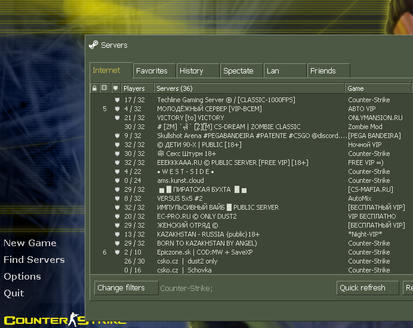
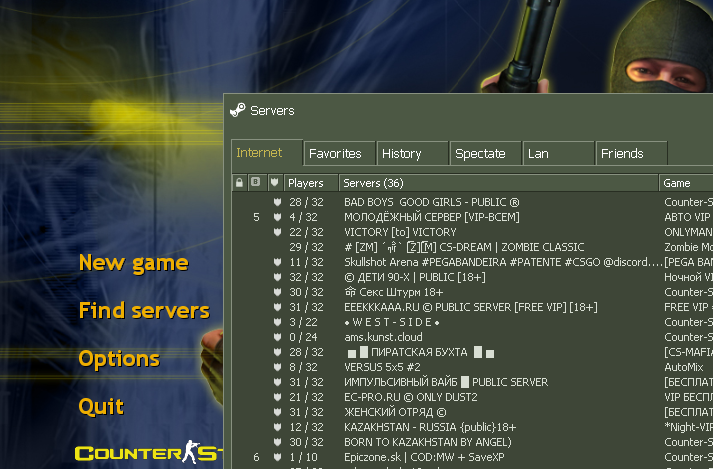
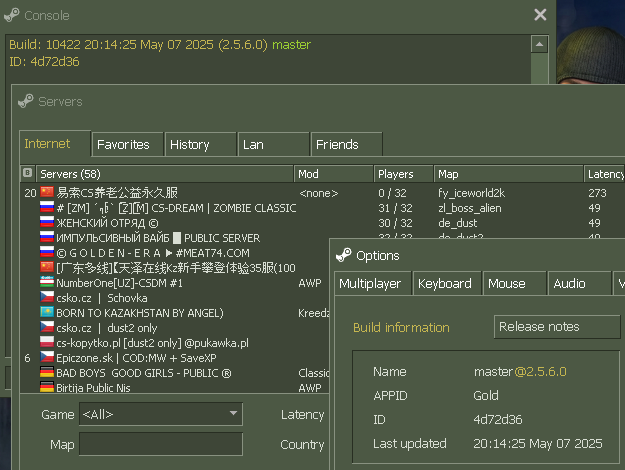

# CS 1.6 Master Servers Restored

Restores custom master server support for Counter-Strike 1.6, allowing server browsers to query independent master servers instead of Valve's deprecated infrastructure.

Works with all three CS 1.6 client variants:
- **Steam Legacy** (pre-25th anniversary update)
- **Anniversary Update** (25th anniversary build)
- **GoldClient/CSPro** (non-Steam client)

## Screenshots

### Steam Legacy


### Anniversary Update


### GoldClient/CSPro


## What is this?

A drop-in proxy DLL (`mastersrv.dll`) that intercepts Steam's matchmaking API to query custom HL1 master servers. The original `ServerBrowser.dll` is patched to load `mastersrv.dll` instead of `steam_api.dll` for matchmaking — all other Steam API calls pass through untouched.

Features:
- Incremental server list population (servers appear as they respond, like the original Steam behavior)
- Sliding window A2S queries (128 concurrent, handles 3000+ server lists)
- Enhanced `setmaster` console command with validation and VDF config writing
- Heartbeat support for listen servers (register your server with any master)
- ReUnion-compatible non-Steam client support (RevEmu, SteamEmu, OldRevEmu, Xash3D, etc.)
- Engine integration via runtime pattern scanning — no engine files modified
- One universal `mastersrv.dll` works with both pre-anniversary and anniversary builds

## Installation

### Steam Legacy & Anniversary

Download the `pre-anniversary` or `anniversary` release and copy into your Half-Life folder:

```
Half-Life/
├── mastersrv.dll                      <- new
└── platform/
    ├── config/
    │   ├── MasterServers.vdf          <- new
    │   └── reunion.cfg                <- new (non-Steam client config)
    └── servers/
        └── ServerBrowser.dll          <- replace
```

Launch with `-insecure` flag.

### GoldClient/CSPro

Download the `goldclient` release:

1. Replace `steam_api.dll` in your game folder with the patched version
2. Append contents of `hosts_append.txt` to `C:\Windows\System32\drivers\etc\hosts` (run as Administrator)

The hosts file blocks `depot.cs-play.net` and `renewal.cs-play.net` to prevent the auto-updater from reverting the patch.

## Configuration

### MasterServers.vdf

Edit `platform/config/MasterServers.vdf` to configure master servers:

```
"MasterServers"
{
    "hl1"
    {
        "0"
        {
            "addr"    "ms.cs16.net:27010"
        }
        "1"
        {
            "addr"    "hl1master.steampowered.com:27011"
        }
    }
}
```

Masters are tried top-down — the first one that responds is used. If none respond, the local server cache is used as fallback. If the VDF file is missing, the default master `ms.cs16.net:27010` is used.

### reunion.cfg

Controls non-Steam client authentication. Uses the same format and options as [ReUnion](https://github.com/rehlds/ReUnion). The default config shipped with the release accepts all common non-Steam emulator types.

Key options:

| Option | Default | Description |
|--------|---------|-------------|
| `AuthVersion` | 4 | Auth protocol version (1-4, higher = newer) |
| `SteamIdHashSalt` | (empty) | Salt for SteamID hashing (16+ chars for AuthVersion >= 3) |
| `cid_RevEmu` | 1 | RevEmu clients: 1=accept, 5=reject |
| `cid_NoSteam48` | 5 | Unknown protocol 48: 1=accept, 3=IP-based ID, 5=reject |
| `LoggingMode` | 3 | 0=none, 1=console, 2=logfile, 3=both |

Config search order:
1. `cstrike/reunion.cfg`
2. `platform/config/reunion.cfg`
3. `reunion.cfg` (Half-Life root)

### setmaster Console Command

```
setmaster <ip[:port]>
```

| Feature | Details |
|---------|---------|
| Validation | Verifies master is reachable before saving (2s timeout) |
| Persistence | Writes to `MasterServers.vdf` and reloads immediately |
| Default port | 27010 if not specified |
| Startup support | Works from launch options (`+setmaster ip:port`) and `config.cfg` |
| Heartbeat | If a listen server is running, automatically registers it with the master |

The command hooks into the engine's console system at runtime via pattern scanning — no engine files are modified. The engine's built-in `setmaster` (which only works for dedicated servers) is replaced transparently.

## Hosting a Listen Server

mastersrv.dll includes full heartbeat support for listen servers using the [Valve HL1 master server protocol](https://developer.valvesoftware.com/wiki/Master_Server_Query_Protocol):

1. Install the mod as described above
2. Start a game (New Game or `map <mapname>` in console)
3. Set `sv_lan 0` to make the server visible on the internet
4. On the Anniversary edition, untick "Enable Steam Networking" in the server creation dialog
5. Run `setmaster <master_ip:port>` to register with a master server
6. Your server will appear in other players' server browsers

Heartbeats are sent every 30 seconds using the engine's own server socket (port 27015). All heartbeat fields are resolved from the engine at runtime:

| Field | Source |
|-------|--------|
| `protocol` | Parsed from `sv_version` cvar |
| `version` | Parsed from `sv_version` cvar |
| `map` | Engine server structure (pattern scanned) |
| `maxplayers` | Engine server structure (pattern scanned) |
| `players` / `bots` | Client array iteration |
| `gamedir` | Engine gamedir buffer (pattern scanned) |
| `password` | `sv_password` cvar |
| `lan` | `sv_lan` cvar |
| `secure` | `-insecure` command line detection |
| `type` | `l` (listen) or `d` (dedicated) via module check |

Port 27015 (UDP) must be open in your router and firewall for the master server to verify your server and for players to connect.

The engine's built-in `heartbeat` console command can be used to send an extra heartbeat on demand. When the server is stopped, heartbeats cease automatically.

You can also put `setmaster <ip:port>` in `config.cfg` or use `+setmaster <ip:port>` in launch options for automatic registration on every start.

## Non-Steam Client Support

mastersrv.dll includes [ReUnion](https://github.com/rehlds/ReUnion)-compatible authentication for non-Steam clients on listen servers. Non-Steam players can join your server without being rejected by Steam validation.

Supported emulator types:
- RevEmu (all variants including 2013, Xash3D)
- SteamClient 2009
- SteamEmu
- OldRevEmu
- AVSMP
- sXe Injected
- NoSteam protocol 47/48

Each non-Steam client gets a unique persistent SteamID derived from their emulator ticket data (HDD serial hash, volume ID, etc.). Steam clients are unaffected and keep their real SteamIDs.

Runtime patches applied to hw.dll (no files modified on disk):
- Steam validation function detour via trampoline
- `CreateUnauthenticatedUserConnection` for bot Steam sessions
- Auth callback flag patches to prevent async Steam kicks
- Certificate length check bypass for non-Steam tickets

Configure via `reunion.cfg` — uses the same format as the [ReUnion plugin](https://github.com/rehlds/ReUnion).

## Building from Source

Requires MinGW cross-compiler (i686-w64-mingw32-g++), Python 3, and a Steam account that owns CS 1.6.

The original `ServerBrowser.dll` binaries are not stored in this repository. They are fetched from Steam's CDN at build time using [DepotDownloader](https://github.com/SteamRE/DepotDownloader), pulling from the CS 1.6 client depots (app 10, branches `steam_legacy` and `public`).

```bash
# Install dependencies (Debian/Ubuntu)
sudo apt-get install gcc-mingw-w64-i686 g++-mingw-w64-i686 python3

# Create .env with your Steam credentials (gitignored)
echo 'STEAM_USERNAME=your_username' > .env
echo 'STEAM_PASSWORD=your_password' >> .env

# Build everything — fetches originals, compiles, patches, packages
bash build.sh

# Output in dist/
#   cs16-masterservers-pre-anniversary.zip
#   cs16-masterservers-anniversary.zip
#   cs16-masterservers-goldclient.zip
```

`build.sh` installs DepotDownloader automatically if not found. The CI workflow uses GitHub Actions secrets for credentials.

## Technical Details

### Architecture

```
ServerBrowser.dll (patched: steam_api.dll → mastersrv.dll)
    ↓ loads
mastersrv.dll (proxy DLL)
    ├── Intercepts: SteamMatchmakingServers, SteamAPI_RunCallbacks, etc.
    ├── Forwards: SteamFriends, SteamApps, SteamMatchmaking → real steam_api.dll
    ├── Queries: MasterServers.vdf → HL1 UDP master protocol
    ├── A2S_INFO: Sliding window (128 concurrent, 2s per-server timeout)
    ├── Caches: platform/cache/servers.dat
    ├── Engine hook: pattern scans hw.dll for console commands, cvars, server state
    ├── Heartbeat: challenge-response via engine's server socket (port 27015)
    └── Reunion: non-Steam auth via emulator detection + CreateUnauthenticatedUserConnection
```

### Proxy DLL Exports

| Function | Pre-Anniversary | Anniversary |
|----------|:-:|:-:|
| SteamMatchmakingServers | x | |
| SteamInternal_ContextInit | | x |
| SteamInternal_FindOrCreateUserInterface | | x |
| SteamAPI_GetHSteamUser | | x |
| SteamAPI_Init | x | x |
| SteamAPI_Shutdown | x | x |
| SteamAPI_RunCallbacks | x | x |
| SteamAPI_RegisterCallback | x | x |
| SteamAPI_UnregisterCallback | x | x |
| SteamFriends | x | |
| SteamApps | x | |
| SteamMatchmaking | x | |

### Engine Integration (Runtime Pattern Scanning)

mastersrv.dll hooks into the engine without modifying any files. During the first `SteamAPI_RunCallbacks`, it scans `hw.dll` memory to resolve:

| Function/Address | Discovery Method |
|-----------------|-----------------|
| `Cmd_AddCommand` | String `"Cmd_AddCommand: %s already defined as a var"` → xref → function start |
| `Cmd_Argc` / `Cmd_Argv` / `Con_Printf` | From original `setmaster` handler's call targets |
| `Cvar_FindVar` | String `"Cvar_RegisterVariable: %s is a command"` → first CALL in that function |
| Server state pointer | `MOV ECX, [addr]` or `CMP [addr], 0` in setmaster handler |
| Map name buffer | String `"map     :  %s at"` → PUSH before it |
| Maxplayers pointer | String `"players :  %i active (%i max)"` → MOV/PUSH before it |
| Client array base | `maxplayers_addr - 4` |
| Client stride | `ADD reg, imm32` in player iteration loop |
| `ip_sockets[]` array | String `"NET_SendPacket: bad address type"` → `MOV ESI,[reg*4+base]` in that function |
| Command linked list head | `MOV reg, [addr]` in `Cmd_AddCommand` body |
| Steam validation function | String `"STEAM validation rejected"` → preceding CALL target |
| Auth callback handler | Byte pattern `8A 81 86 00 00 00 84 C0` (flag check in callback) |

### Protocols

**Master Server Query** (client → master):
- Request: `0x31` + region + last IP:port + filter string
- Response: `0xFFFFFFFF 0x66 0x0A` + (IP:4B + port:2B)* + `0.0.0.0:0`

**Heartbeat** (server → master):
- Challenge: `0xFFFFFFFF 0x71` → master replies `0xFFFFFFFF 0x73 0x0A` + 4-byte challenge
- Registration: `0\n\protocol\48\challenge\<N>\players\<N>\max\<N>\bots\<N>\gamedir\<S>\map\<S>\type\<l|d>\password\<0|1>\os\w\secure\<0|1>\lan\<0|1>\version\<S>\region\255\product\<S>\n`

**A2S_INFO** (client → game server):
- Request: `0xFFFFFFFF 0x54 "Source Engine Query\0"`
- Response: Server name, map, players, maxplayers, bots, ping, etc.
